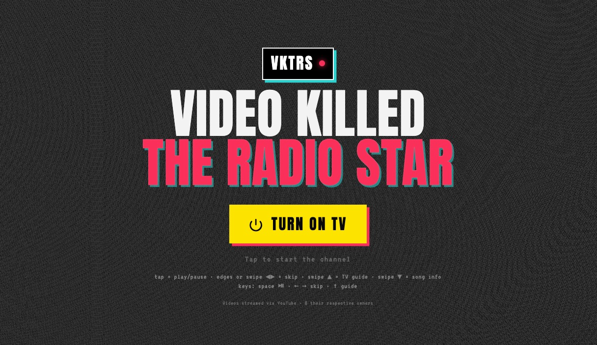

<p align="center">
  
</p>

<h1 align="center"><a href="https://www.youtube.com/watch?v=W8r-tXRLazs">VideoKilledTheRadioStar (VKTRS)</a></h1>

<p align="center">
  <a href="https://konradmichalik.github.io/video-killed-the-radio-star/"></a>
  <a href="LICENSE"></a>
  
  
  
</p>

<p align="center">
A full-screen retro-TV PWA that turns a curated catalogue of music videos into a lean-back MTV-style channel — complete with CRT overlay, channel-change static, neo-brutalist UI, and a self-rated guess game. Built with Vite + Svelte 5. Mobile-first, iPad-optimised, installable offline.
</p>

> It hosts no media. Videos stream via the YouTube IFrame Player API and remain © their respective owners.

## 🚀 Quick Start

**Watch it live** → [konradmichalik.github.io/video-killed-the-radio-star](https://konradmichalik.github.io/video-killed-the-radio-star/)

Works in any modern browser, but for the canonical experience: open the link on your **iPad / iPhone in Safari → Share → Add to Home Screen**. The installed PWA runs full-screen, supports offline launch, and (thanks to iOS ITP) is practically ad-free.

<details>
<summary><b>Run it locally</b> — for hacking or LAN testing</summary>

```bash
npm install
npm run dev        # Vite dev server on :5173, LAN-visible
```

Then open the printed **Network:** URL (e.g. `http://192.168.x.x:5173`) on your iPad/phone, or `http://localhost:5173` on desktop.

> [!IMPORTANT]
> YouTube embeds require an `http(s)` origin. Always use the dev server URL — never open `file://` directly.

```bash
npm run build      # Production build + PWA service worker
npm run preview    # Preview the built dist
npm run verify     # Check all videos.json IDs are reachable and embeddable
```

> [!NOTE]
> The PWA service worker only registers on **HTTPS or `localhost`**. Test offline behaviour there, not on a LAN IP.

</details>

> [!TIP]
> **About YouTube ads** — VKTRS streams via the YouTube IFrame Player, and YouTube serves pre-roll ads on embedded third-party sites. We use the privacy-enhanced `youtube-nocookie.com` host and detect ad playback (`ADVERTISEMENT` indicator + tap-through to YouTube's own "Skip Ad" button), but the ads themselves cannot be suppressed in a Terms-of-Service-compliant way. **For a (practically) ad-free experience, install VKTRS as a PWA on the iPad/iPhone home screen** — iOS Intelligent Tracking Prevention in standalone webview context dramatically reduces (and often eliminates) embedded ad delivery.

## ✨ Features

- **Full-screen channel** — shuffle play, smooth preloaded song-to-song transitions, "▶ COMING UP" teasers, end-screen suppression (~1.5 s preempt before YouTube's "more videos" overlay)
- **TV Guide** — year range, genre and country filters, one-tap channel presets, CRT / SONG INFO / STATION LOGO toggles
- **Search** with ranked autocomplete; **Queue** editor with drag-to-reorder; **Settings** panel
- **Guess game** — lean-back mode with title mask, self-rated reveal, running streak and hit-rate
- **Neo-brutalist UI** — VKTRS station-bug logo (player corner), "VIDEO KILLED / THE RADIO STAR" wordmark with RGB-glitch effect on the start screen and all overlay sheets, hard teal offset shadows
- **Curated catalogue** — enriched via Hitster card datasets and MusicBrainz API, verified embeddable
- **Installable PWA** — Workbox precaches the app shell and `videos.json`; launches offline (streaming still needs the network)
- **iPad-hardened** — wake lock, fullscreen API, autoplay fallback, test-card error states, reduced-motion support

## 🤝 Contributing

The easiest way to contribute is to suggest tracks for the catalogue or to fix broken / wrong replacement IDs.

**Suggest a new song** — open an issue (or PR) with:

| Field                   | Example                                    |
| ----------------------- | ------------------------------------------ |
| Artist                  | `Talking Heads`                            |
| Title                   | `Once in a Lifetime`                       |
| Year (original release) | `1980`                                     |
| Genre                   | `New Wave`                                 |
| Country (artist origin) | `United States`                            |
| YouTube `video_id`      | `I1wg1DNHbNU` (the 11-char `v=` parameter) |

Bonus points if you've checked that the video is actually embeddable (no `not-embeddable` / `not-found` from `npm run verify`) and is the **official music video** — not a lyric video, audio rip, or fan upload.

The maintainer will append your submission to `scripts/seed-tracks.json`, run `scripts/enrich.mjs` + `scripts/verify.mjs` to confirm embeddability, and add it to `public/videos.json`. See [DEVELOPMENT.md](DEVELOPMENT.md) for the in-app dev-review mode that lets active maintainers walk the catalogue and submit replacement IDs from the browser console.

## 🛠 Development

For local development, dev review mode, data pipeline scripts, and the GitHub Pages deployment workflow, see [`DEVELOPMENT.md`](DEVELOPMENT.md).

## 📜 License

Source code is **MIT licensed** — see [`LICENSE`](LICENSE). Music videos stream from YouTube and remain © their respective owners, subject to the [YouTube Terms of Service](https://www.youtube.com/t/terms). A notice is shown in-app on the start screen and in the TV Guide.
